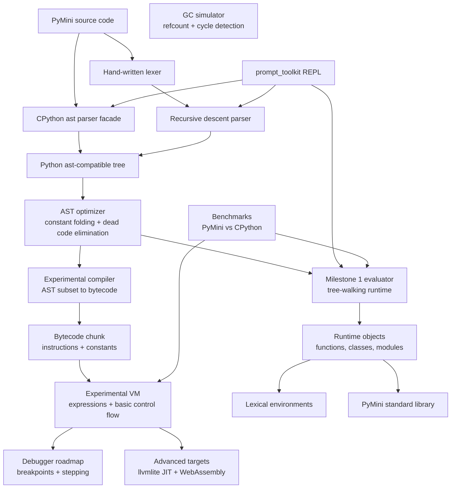

# PyMini

[](https://github.com/Sebby1770/PyMini/actions/workflows/ci.yml)

PyMini is a mini-Python implementation designed as a staged interpreter project:
first a parser and tree-walking evaluator, then an optimizer, compiler, bytecode VM,
runtime, garbage collector simulation, REPL, benchmarks, and advanced targets.

## Architecture



## Milestones

1. Parser and basic evaluator.
   - CPython `ast` parser facade.
   - Hand-written lexer and recursive descent parser for the early subset.
   - Tree-walking evaluator with variables, lexical scope, closures, classes,
     inheritance, control flow, lists, dicts, arithmetic, and safe imports.
   - AST optimizer pass for constant folding and simple dead code elimination.
2. Compiler and bytecode VM.
   - Typed instructions, constants, jumps, disassembly, frame stack, and execution limits.
   - Expression, collection, control-flow, iteration, and built-in-call subset implemented.
   - Functions, closures, class construction, and import opcodes remain roadmap work.
3. Runtime and memory model.
   - Stable object protocols, method binding, module loader.
   - Reference counting and cycle detection simulation integrated into objects.
4. Developer experience.
   - `prompt_toolkit` REPL with Python syntax highlighting.
   - Tracebacks, diagnostics, source spans, debug hooks.
5. Benchmarks and conformance tests.
   - Microbenchmarks against CPython.
   - Golden tests for parser, evaluator, optimizer, VM, and stdlib behavior.

## Advanced Roadmap

- JIT backend with `llvmlite`: lower hot bytecode traces into LLVM IR.
- WebAssembly target: emit a compact stack-machine module for browser demos.
- Debugger: breakpoints, stepping, frame inspection, and watch expressions.
- Bytecode trace visualizer and interactive stepping.
- Gradual expansion of Python compatibility: comprehensions, exceptions, keyword
  arguments, descriptors, decorators, generators, and async.

## Quick Start

```bash
cd PyMini
poetry install
poetry run pytest
poetry run pymini -c "x = 2 + 3 * 4\nx"
poetry run pymini --engine vm -c "x = 2 + 3 * 4\nx"
poetry run pymini --engine vm --disassemble -c "x = 2 + 3"
poetry run pymini
```

Without Poetry:

```bash
cd PyMini
PYTHONPATH=src python -m pytest
PYTHONPATH=src python -m pymini -c "def make(x):\n    def add(y):\n        return x + y\n    return add\nmake(10)(5)"
```

## Execution engines

- `evaluator` is the default and supports the documented Milestone 1 language subset.
- `vm` is an experimental, bounded stack machine for constants, names, collections,
  subscripting, arithmetic, comparisons, boolean short-circuiting, calls to the built-in
  allow-list, `if`, `while`, `for`, `break`, and `continue`. Unsupported syntax fails
  during compilation before bytecode execution.

Both engines share one parse-and-optimize pipeline and enforce a configurable execution
step budget. They also use one bounded builtin registry, including identical injectable
output behavior. The REPL accepts injectable input/output callbacks for embedding and tests.
PyMini is an educational interpreter, not a security sandbox; do not use it to execute
untrusted code.

The benchmark warms both runtimes and reports the median of repeated measurements instead
of a noisy single timing. Run `make benchmark` for readable output or `make benchmark-json`
for machine-readable results.

The evaluator caches AST-node dispatch after first use, avoiding repeated reflective method
lookup inside hot loops. Differential tests run the shared compiler subset through both
engines and require identical results.

Run `make verify` before publishing changes. Release-facing changes are recorded in
[CHANGELOG.md](CHANGELOG.md). See [CONTRIBUTING.md](CONTRIBUTING.md) before opening a
pull request and report vulnerabilities according to [SECURITY.md](SECURITY.md).
Verification installs the built wheel into an isolated environment and executes the
published `pymini` command, so packaging and entry-point regressions fail before release.
