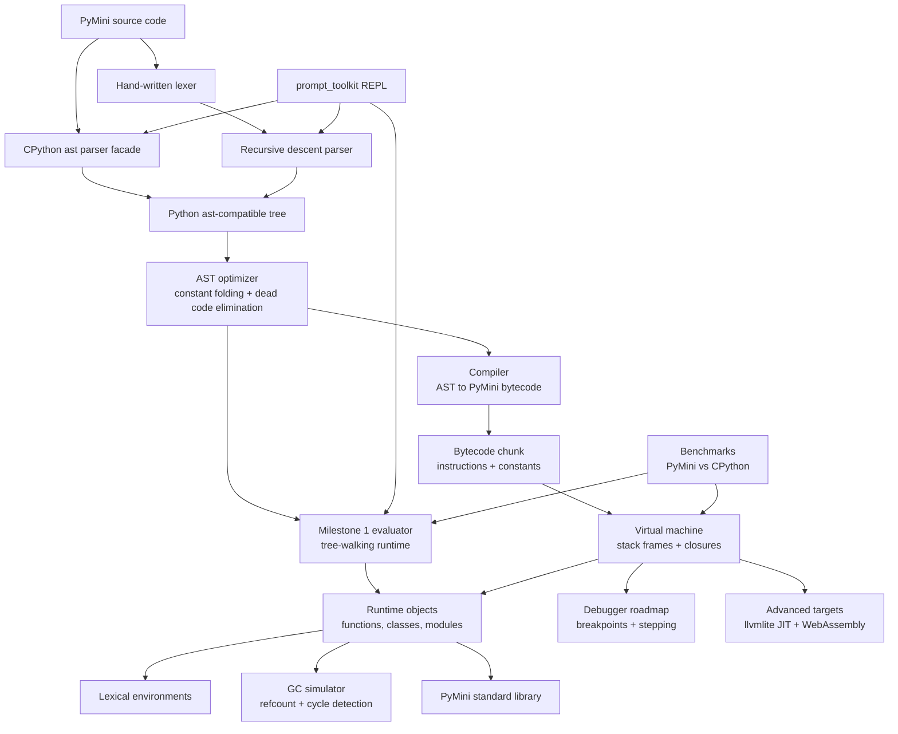

# PyMini

PyMini is a mini-Python implementation designed as a staged interpreter project:
first a parser and tree-walking evaluator, then an optimizer, compiler, bytecode VM,
runtime, garbage collector simulation, REPL, benchmarks, and advanced targets.

## Architecture



## Milestones

1. Parser and basic evaluator.
   - CPython `ast` parser facade.
   - Hand-written lexer and recursive descent parser for the early subset.
   - Tree-walking evaluator with variables, lexical scope, closures, classes,
     inheritance, control flow, lists, dicts, arithmetic, and safe imports.
   - AST optimizer pass for constant folding and simple dead code elimination.
2. Compiler and bytecode VM.
   - Instruction set, chunk format, constants table, stack machine, frames.
   - Closure cells, class construction opcodes, import opcodes.
3. Runtime and memory model.
   - Stable object protocols, method binding, module loader.
   - Reference counting and cycle detection simulation integrated into objects.
4. Developer experience.
   - `prompt_toolkit` REPL with Python syntax highlighting.
   - Tracebacks, diagnostics, source spans, debug hooks.
5. Benchmarks and conformance tests.
   - Microbenchmarks against CPython.
   - Golden tests for parser, evaluator, optimizer, VM, and stdlib behavior.

## Advanced Roadmap

- JIT backend with `llvmlite`: lower hot bytecode traces into LLVM IR.
- WebAssembly target: emit a compact stack-machine module for browser demos.
- Debugger: breakpoints, stepping, frame inspection, and watch expressions.
- Bytecode disassembler and trace visualizer.
- Gradual expansion of Python compatibility: comprehensions, exceptions, keyword
  arguments, descriptors, decorators, generators, and async.

## Quick Start

```bash
cd PyMini
poetry install
poetry run pytest
poetry run pymini -c "x = 2 + 3 * 4\nx"
poetry run pymini
```

Without Poetry:

```bash
cd PyMini
PYTHONPATH=src python -m pytest
PYTHONPATH=src python -m pymini -c "def make(x):\n    def add(y):\n        return x + y\n    return add\nmake(10)(5)"
```

