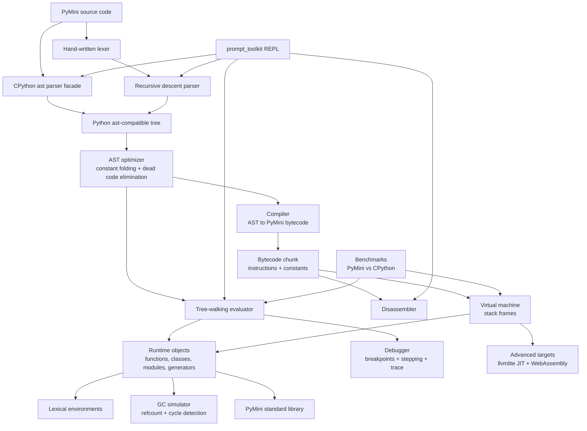

# PyMini

PyMini is a mini-Python implementation designed as a staged interpreter project:
parser and tree-walking evaluator, AST optimizer, bytecode compiler/VM,
disassembler, runtime objects, GC simulation hooks, REPL, debugger, and benchmarks.

**Version 0.3.0**

## Architecture



## What's supported (0.3.0)

### Evaluator (CPython `ast` parser path — primary)

| Area | Status |
|------|--------|
| Variables, arithmetic, comparisons, bool ops | Yes |
| `if` / `while` / `for`, `break` / `continue` | Yes |
| Functions, closures, default args, `*args`, starred calls | Yes |
| Keyword args, `**kwargs`, keyword-only (`*`) parameters | Yes |
| `lambda` expressions | Yes |
| `assert` (optional message) | Yes |
| Generators (`yield`), `MiniGenerator`, for-loop iteration | Yes (basic) |
| Classes, methods, inheritance | Yes |
| Lists, dicts, sets, tuples, subscripts | Yes |
| List / dict / set comprehensions | Yes |
| f-strings (`JoinedStr`) | Yes |
| `try` / `except` / `finally`, `raise` | Yes (basic `Exception` hierarchy) |
| `with` / context managers (`__enter__` / `__exit__`) | Yes |
| Expanded builtins (enumerate, zip, map, filter, sorted, …) | Yes |
| Safe stdlib (`math`, `random`, `json`, `pymini`) | Yes |
| Hand-written parser | Smaller subset (no comprehensions/f-strings/try) |

### Bytecode compiler + VM

Stack machine for educational disassembly and execution:

- `LOAD_CONST`, `LOAD_NAME`, `STORE_NAME`, `POP_TOP`
- `BINARY_ADD` / `SUB` / `MUL` / `DIV` / `MOD` / `POW`
- `UNARY_NEGATIVE`, `UNARY_NOT`
- `COMPARE_OP`, `JUMP`, `JUMP_IF_FALSE`, `JUMP_IF_TRUE`
- `GET_ITER`, `FOR_ITER` (for-loops)
- `RETURN_VALUE`, `CALL`, `MAKE_FUNCTION`
- `BUILD_LIST` / `TUPLE` / `DICT` / `SET`

Supports module-level assignments, arithmetic, `if`/`while`/`for`, simple functions, and calls.

### Debugger & tracing

- `pymini run --trace` — print each line before execution
- `pymini debug script.py` / `pymini run --debug` — breakpoints, step, continue, locals

## Milestones

1. [x] Parser and basic evaluator
   - [x] CPython `ast` parser facade
   - [x] Hand-written lexer and recursive descent parser for the early subset
   - [x] Tree-walking evaluator (variables, scope, closures, classes, control flow, containers)
   - [x] AST optimizer (constant folding + dead code elimination)
   - [x] try/except/finally, with, *args/defaults, comprehensions, f-strings
   - [x] lambda, assert, kwargs/**kwargs, basic generators
2. [x] Compiler and bytecode VM (expanded subset)
   - [x] Instruction set, chunk format, constants table, stack machine
   - [x] Disassembler (`pymini disasm` / `--disasm`)
   - [x] MOD/POW/unary/SET/for-iter opcodes
   - [ ] Full closure cells, class opcodes, import opcodes (roadmap)
3. [ ] Runtime and memory model
   - [ ] Stable object protocols beyond current Mini* types
   - [x] Reference counting / cycle detection *simulator* scaffolding
4. [x] Developer experience
   - [x] `prompt_toolkit` REPL with highlighting
   - [x] Tracebacks with line numbers
   - [x] `help()` / `dis()` REPL builtins
   - [x] Line tracer and lightweight debugger
   - [x] CLI subcommands (`run`, `eval`, `disasm`, `repl`, `version`, `debug`)
5. [ ] Benchmarks and broader conformance tests

## Advanced Roadmap

- JIT backend with `llvmlite`
- WebAssembly target for a numeric subset
- Richer generator `send` / `yield from` parity
- Broader Python compatibility (descriptors, async)

## Quick Start

### With pip (recommended for CI / simple installs)

```bash
cd PyMini
pip install -e ".[dev]"
pytest
pymini -c "x = 2 + 3 * 4\nx"
pymini eval -c "sum(range(10))"
pymini run --trace examples/demo.py
pymini disasm -c "x = 1 + 2"
pymini version
pymini
```

### Without installing (PYTHONPATH)

```bash
cd PyMini
pip install pytest prompt-toolkit pygments
PYTHONPATH=src python -m pytest
PYTHONPATH=src python -m pymini -c "def make(x):\n    def add(y):\n        return x + y\n    return add\nmake(10)(5)"
PYTHONPATH=src python -m pymini --disasm -c "x = 1 + 2"
```

### With Poetry (optional)

```bash
cd PyMini
poetry install
poetry run pytest
poetry run pymini
```

## Disassembler example

```bash
$ pymini --disasm -c "x = 1 + 2"
-- disassembly of '<module>' --
  constants: [1, 2, None]
0  L1  LOAD_CONST 0 (1)
1  L1  LOAD_CONST 1 (2)
2  L1  BINARY_ADD
3  L1  STORE_NAME x
4      LOAD_CONST 2 (None)
5      RETURN_VALUE
```

In the REPL:

```text
PyMini 0.3.0 — educational mini-Python. Type help() or Ctrl-D to exit.
>>> help()
>>> dis("x = 1 + 2")
```

## API

```python
from pymini import evaluate, parse, compile_source, disassemble, run_bytecode

evaluate(" [x*x for x in range(4)] ")   # [0, 1, 4, 9]
evaluate("(lambda x: x + 1)(41)")       # 42
evaluate("def g():\n    yield 1\n    yield 2\nlist(g())")  # [1, 2]
print(disassemble("x = 1 + 2"))
run_bytecode("def f(n):\n    return n * 2\nf(21)")  # 42
```

## CLI

| Command / flag | Meaning |
|----------------|---------|
| `pymini run file.py` | Run a file |
| `pymini eval -c 'code'` | Evaluate a snippet |
| `pymini disasm file.py` | Disassemble |
| `pymini repl` | Interactive REPL |
| `pymini version` | Print version |
| `pymini debug script.py` | Interactive debugger |
| `-c CODE` | Evaluate (or disassemble) a snippet |
| `--disasm` | Print bytecode instead of running |
| `--vm` | Run on the bytecode VM |
| `--trace` | Line-trace mode |
| `--debug` | Debugger mode |
| `--break N` | Breakpoint at line N |
| `--parser ast\|handwritten` | Choose frontend |
| `--no-optimize` | Skip AST optimizer |
| `--version` | Print version |

## Tests & CI

```bash
pip install -e ".[dev]"
pytest
```

GitHub Actions (`.github/workflows/ci.yml`) runs pytest on Python 3.11 and 3.12.

## License

MIT — see [LICENSE](LICENSE).
