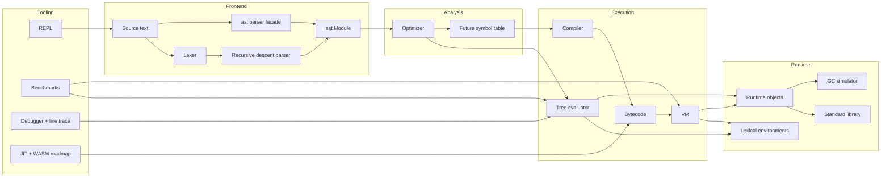

# PyMini Architecture

The milestone implementation uses `ast.Module` as the interchange format. That
lets the `ast` parser and the hand-written parser share the evaluator, optimizer,
and compiler pipeline.

### Runtime highlights (0.3)

- **Evaluator**: lambda, assert, kwargs/`**kwargs`, keyword-only params, basic
  `yield` generators (`MiniGenerator` + generator-style statement evaluation).
- **Builtins**: enumerate, zip, map, filter, sorted, reversed, sum, min, max,
  any, all, abs, round, isinstance, type, hasattr/getattr/setattr.
- **Stdlib**: expanded `math`, `random`, `json`, and `pymini.version`.
- **VM**: MOD/POW, unary ops, BUILD_SET, GET_ITER/FOR_ITER, JUMP_IF_TRUE.
- **Debugger**: breakpoints, step/continue, locals inspection; `--trace` mode.

