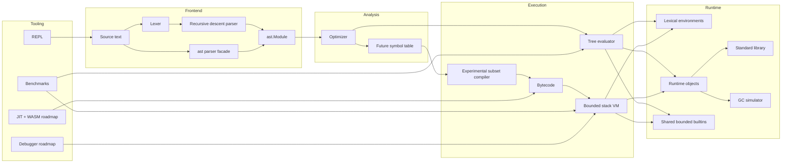

# PyMini Architecture

`ast.Module` is the single interchange format. `pymini.pipeline.prepare_module`
owns parsing and optimization, so the public API, CLI, evaluator, and VM cannot drift
into separate frontend behavior. The evaluator implements the broad Milestone 1 subset.
The experimental compiler validates its narrower subset while emitting bytecode; the VM
uses one frame-owned operand stack and resets its execution budget for every run.
The evaluator resolves each AST node type once and caches its bound handler for subsequent
dispatch, retaining source-aware errors without repeated reflective lookup in hot loops.
The evaluator and VM install builtins from one registry so their callable allow-list and
output behavior cannot drift. REPL I/O is injected at its boundary rather than embedded in
the execution engine.

The garbage-collector module remains an isolated simulator and is not represented as the
memory manager for either execution engine. Its reference-count and cycle APIs nevertheless
enforce heap invariants, perform cascading releases, and collect unreachable cycles without
mutating rooted graphs.
