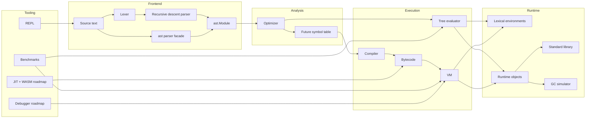

# PyMini Architecture

The milestone implementation uses `ast.Module` as the interchange format. That
lets the `ast` parser and the hand-written parser share the evaluator, optimizer,
and future compiler pipeline.

